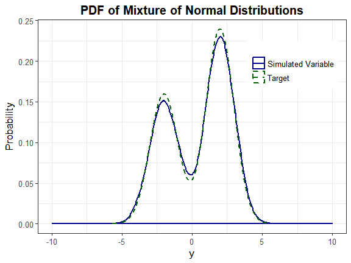
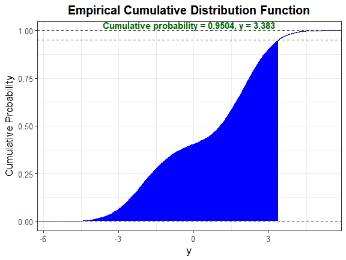

<!-- README.md is generated from README.Rmd. Please edit that file -->
SimCorrMix
==========

The goal of **SimCorrMix** is to generate continuous (normal, non-normal, or mixture distributions), binary, ordinal, and count (Poisson or Negative Binomial, regular or zero-inflated) variables with a specified correlation matrix, or one continuous variable with a mixture distribution. This package can be used to simulate data sets that mimic real-world clinical or genetic data sets (i.e. plasmodes, as in Vaughan et al., 2009, <doi:10.1016/j.csda.2008.02.032>). The methods extend those found in the **SimMultiCorrData** package. Standard normal variables with an imposed intermediate correlation matrix are transformed to generate the desired distributions. Continuous variables are simulated using either Fleishman (1978)'s third-order (<doi:10.1007/BF02293811>) or Headrick (2002)'s fifth-order (<doi:10.1016/S0167-9473(02)00072-5>) power method transformation (PMT). Non-mixture distributions require the user to specify mean, variance, skewness, standardized kurtosis, and standardized fifth and sixth cumulants. Mixture distributions require these inputs for the component distributions plus the mixing probabilities. Simulation occurs at the component-level for continuous mixture distributions. The target correlation matrix is specified in terms of correlations with components of continuous mixture variables. However, the package provides functions to determine expected correlations with continuous mixture variables given target correlations with the components. Binary and ordinal variables are simulated using a modification of GenOrd-package's ordsample function. Count variables are simulated using the inverse CDF method. There are two simulation pathways which calculate intermediate correlations involving count variables differently. **Correlation Method 1** adapts Yahav and Shmueli's 2012 method (<doi:10.1002/asmb.901>). **Correlation Method 2** adapts Barbiero and Ferrari's 2015 modification of the **GenOrd** package (<doi:10.1002/asmb.2072>). The optional error loop may be used to improve the accuracy of the final correlation matrix. The package also contains functions to calculate the standardized cumulants of continuous mixture distributions, check parameter inputs, calculate feasible correlation boundaries, and plot simulated variables.

There are several vignettes which accompany this package that may help the user understand the simulation and analysis methods.

1.  **Calculation of Correlation Boundaries** explains how the feasible correlation boundaries are calculated for each of the two simulation pathways (using `validcorr` and `validcorr2`).

2.  **Comparison of Correlation Methods 1 and 2** describes the two simulation pathways that can be followed for generation of correlated data (using `corrvar` and `corrvar2`).

3.  **Continuous Mixture Distributions** demonstrates how to simulate one continuous mixture variable using `contmixvar1` and gives a step-by-step guideline for comparing a simulated distribution to the target distribution.

4.  **Error Loop Algorithm** details the algorithm involved in the optional error loop that helps to minimize correlation errors.

5.  **Expected Cumulants and Correlations for Continuous Mixture Variables** derives the equations used by the function `calc_mixmoments` to find the mean, standard deviation, skew, standardized kurtosis, and standardized fifth and sixth cumulants for a continuous mixture variable. The vignette also explains how the functions `rho_M1M2` and `rho_M1Y` calculate the expected correlations with continuous mixture variables based on the target correlations with the components.

6.  **Overall Workflow for Generation of Correlated Data** gives a step-by-step guideline to follow with an example containing continuous non-mixture and mixture, ordinal, zero-inflated Poisson, and zero-inflated Negative Binomial variables. It executes both correlated data simulation functions with and without the error loop.

7.  **Variable Types** describes the different types of variables that can be simulated in **SimCorrMix**.

Installation instructions
-------------------------

`SimCorrMix` can be installed using the following code:

``` r
## from GitHub
install.packages("devtools")
devtools::install_github("AFialkowski/SimCorrMix", build_vignettes = TRUE)

## from CRAN
install.packages("SimCorrMix")
```

Example
-------

This is a basic example which shows you how to solve a common problem:

Headrick and Kowalchuk's steps (2007, <doi:10.1080/10629360600605065>) to compare the density of a simulated variable to the theoretical density have been modified to accommodate continuous mixture distributions. The component distributions are *Normal(-2, 1)* and *Normal(2, 1)*. The mixing proportions are 0.4 and 0.6.

### Step 1: Obtain the standardized cumulants

The values of *γ*<sub>1</sub>,  *γ*<sub>2</sub>,  *γ*<sub>3</sub>, and *γ*<sub>4</sub> are all 0 for normal variables. The mean and standard deviation of the mixture variable are found with `calc_mixmoments`.

``` r
library("SimCorrMix")
#> Loading required package: SimMultiCorrData
#> 
#> Attaching package: 'SimMultiCorrData'
#> The following object is masked from 'package:stats':
#> 
#>     poly
library("printr")
options(scipen = 999)
n <- 10000
mix_pis <- c(0.4, 0.6)
mix_mus <- c(-2, 2)
mix_sigmas <- c(1, 1)
mix_skews <- rep(0, 2)
mix_skurts <- rep(0, 2)
mix_fifths <- rep(0, 2)
mix_sixths <- rep(0, 2)
Nstcum <- calc_mixmoments(mix_pis, mix_mus, mix_sigmas, mix_skews, 
  mix_skurts, mix_fifths, mix_sixths)
```

### Step 2: Simulate the variable

Note that `calc_mixmoments` returns the standard deviation, not the variance. The simulation functions require variance as the input. First, the parameter inputs are checked with `validpar`.

``` r
validpar(k_mix = 1, method = "Polynomial", means = Nstcum[1], 
  vars = Nstcum[2]^2, mix_pis = mix_pis, mix_mus = mix_mus, 
  mix_sigmas = mix_sigmas, mix_skews = mix_skews, mix_skurts = mix_skurts, 
  mix_fifths = mix_fifths, mix_sixths = mix_sixths)
#> [1] TRUE
Nmix2 <- contmixvar1(n, "Polynomial", Nstcum[1], Nstcum[2]^2, mix_pis, mix_mus, 
  mix_sigmas, mix_skews, mix_skurts, mix_fifths, mix_sixths)
#> 
#>  Constants: Component  1  
#> 
#>  Constants: Component  2  
#> 
#> Constants calculation time: 0 minutes 
#> Total Simulation time: 0.005 minutes
```

Look at a summary of the target distribution and compare to a summary of the simulated distribution.

``` r
knitr::kable(Nmix2$target_mix, digits = 5, row.names = FALSE, 
  caption = "Summary of Target Distribution")
```

|  Distribution|  mean|   sd|     skew|  skurtosis|    fifth|    sixth|
|-------------:|-----:|----:|--------:|----------:|--------:|--------:|
|             1|   0.4|  2.2|  -0.2885|   -1.15402|  1.79302|  6.17327|

``` r
knitr::kable(Nmix2$mix_sum, digits = 5, row.names = FALSE, 
  caption = "Summary of Simulated Distribution")
```

|  Distribution|      n|  mean|   sd|   median|       min|    max|     skew|  skurtosis|    fifth|   sixth|
|-------------:|------:|-----:|----:|--------:|---------:|------:|--------:|----------:|--------:|-------:|
|             1|  10000|   0.4|  2.2|  1.05078|  -5.69433|  5.341|  -0.2996|   -1.15847|  1.84723|  6.1398|

### Step 3: Determine if the constants generate a valid power method PDF

``` r
Nmix2$constants
```

|   c0|   c1|   c2|   c3|   c4|   c5|
|----:|----:|----:|----:|----:|----:|
|    0|    1|    0|    0|    0|    0|
|    0|    1|    0|    0|    0|    0|

``` r
Nmix2$valid.pdf
#> [1] "TRUE" "TRUE"
```

### Step 4: Select a critical value

Let *α* = 0.05. Since there are no quantile functions for mixture distributions, determine where the cumulative probability equals 1 − *α* = 0.95. The boundaries for `uniroot` were determined through trial and error.

``` r
fx <- function(x) 0.4 * dnorm(x, -2, 1) + 0.6 * dnorm(x, 2, 1)
cfx <- function(x, alpha, FUN = fx) {
  integrate(function(x, FUN = fx) FUN(x), -Inf, x, subdivisions = 1000, 
    stop.on.error = FALSE)$value - (1 - alpha)
}
y_star <- uniroot(cfx, c(3.3, 3.4), tol = 0.001, alpha = 0.05)$root
y_star
#> [1] 3.382993
```

### Step 5: Calculate the cumulative probability for the simulated variable up to 1 − *α*

We will use the function `SimMultiCorrData::sim_cdf_prob` to determine the cumulative probability for *Y* up to `y_star`. This function is based on Martin Maechler's `stats::ecdf` function.

``` r
sim_cdf_prob(sim_y = Nmix2$Y_mix[, 1], delta = y_star)$cumulative_prob
#> [1] 0.9504
```

This is approximately equal to the 1 − *α* value of 0.95, indicating the method provides a **good approximation to the actual distribution.**

### Step 6: Plot graphs

``` r
plot_simpdf_theory(sim_y = Nmix2$Y_mix[, 1], ylower = -10, yupper = 10, 
  title = "PDF of Mixture of Normal Distributions", fx = fx, lower = -Inf, 
  upper = Inf)
```



We can also plot the empirical cdf and show the cumulative probability up to y\_star.

``` r
plot_sim_cdf(sim_y = Nmix2$Y_mix[, 1], calc_cprob = TRUE, delta = y_star)
```


