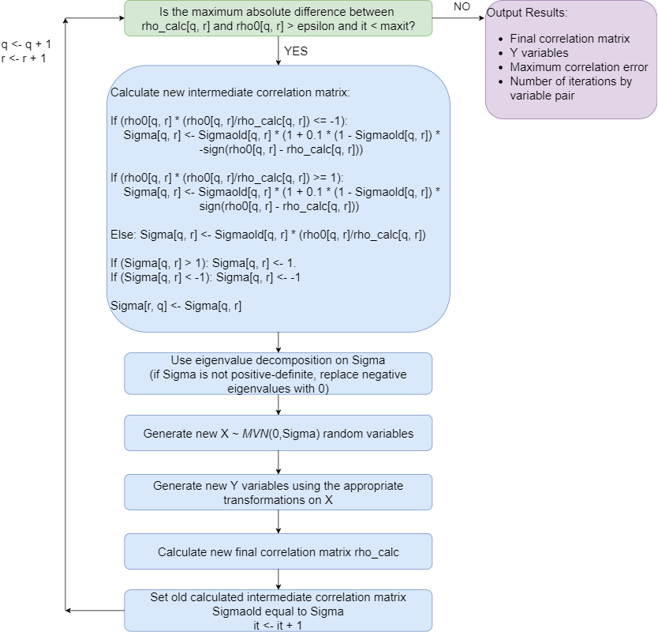

<style type="text/css">

h1.title {
  text-align: center;
}
h4.author { /* Header 4 - and the author and data headers use this too  */
  text-align: center;
}
h4.date { /* Header 4 - and the author and data headers use this too  */
  text-align: center;
}
</style>

```{r setup, echo = FALSE}
knitr::opts_chunk$set(echo = FALSE, message = FALSE, warning = FALSE, fig.align = 'center')
```

```{r, include=FALSE}
library("bookdown")
```

The **error loop** may be used to correct the final pairwise correlation of simulated variables to be within a user-specified precision value (`epsilon`) of the target correlation.  It updates the pairwise intermediate MVN correlation iteratively in a loop until either the maximum error is less than `epsilon` or the number of iterations exceeds the maximum number set by the user (`maxit`).  Some code has been modified from the **SimMultiCorrData** package [@SMCD].  The function modifies @GenOrd `ordcont` function in the `GenOrd` package in the following ways: 
1. It works for continuous (non-mixture or components of mixture), ordinal ($r \ge 2$ categories), and count (regular or zero-inflated, Poisson or Negative Binomial) variables.
1. The initial positive-definite correlation check has been removed because the intermediate correlation `Sigma` from `corrvar` or `corrvar2` has already been used to generate variables (and therefore is positive-definite).
1. Eigenvalue decomposition is done on `Sigma` to impose the correct intermediate correlations on the normal variables.  If `Sigma` is not positive-definite, the negative eigenvalues are replaced with 0.
1. The final positive-definite check has been removed.
1. The intermediate correlation update function was changed to accommodate more situations.
1. Allowing specifications for the sample size and the seed for reproducibility.  

The error loop does increase simulation time, but it can improve accuracy in most situations.  It may be unsuccessful in more difficult to obtain correlation structures.  Some cases utilizing negative correlations will have results similar to those without the error loop.  Trying different values of `epsilon` (i.e., $0.01$ instead of $0.001$) can help in these cases.  For a given row (`q` = 1, ..., `nrow(Sigma)`), the error loop progresses through the intermediate correlation matrix `Sigma` by increasing column index (`r` = 2, ..., `ncol(Sigma)`, `r` not equal to `q`).  Each time a new pairwise correlation `Sigma[q, r]` is calculated, the new `Sigma` matrix is imposed on the intermediate normal variables `X`, the appropriate transformations are applied to get `Y`, and the final correlation matrix `rho_calc` is found.  Even though the intermediate correlations from previous `q, r` combinations are not changed, the final correlations are affected.  The fewer iterations for a given `q, r` combination, the less `rho_calc[q, r]` changes.  Since larger values of `epsilon` require fewer iterations, using `epsilon = 0.01` may give better results than `epsilon = 0.001`.

Below is a schematic of the algorithm.  In the figure, `rho_calc` is the calculated final correlation matrix updated in each iteration, `rho0` is the target final correlation matrix, `Sigmaold` is the intermediate correlation matrix from the previous iteration, `it` is the iteration number, `q` is the row number, and `r` is the column number.

```{r, out.width = "85%", fig.cap = "Overview of error loop."}

```

# References {-}

<script type="text/x-mathjax-config">
   MathJax.Hub.Config({  "HTML-CSS": { minScaleAdjust: 115, availableFonts: [] }  });
</script>
